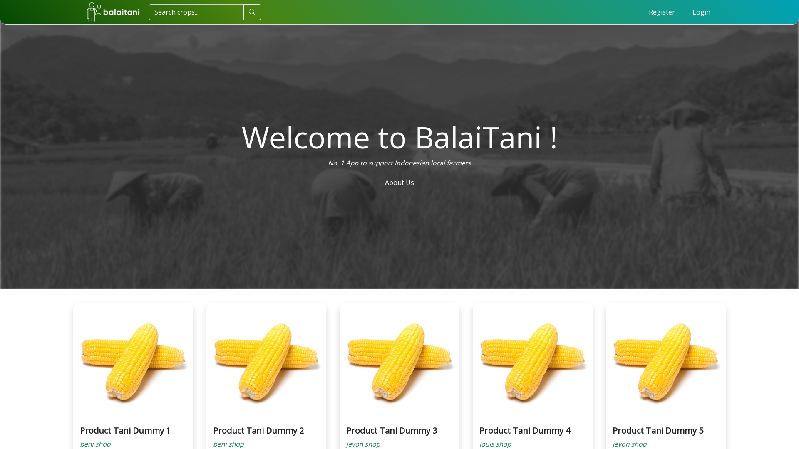

<p align="center"><a href="https://balaitani.herokuapp.com" target="_blank"></a></p>

# BalaiTani
**BalaiTani** (roughly translated from Indonesian as *farmers' hall*) is an e-commerce web app designed as a platform for connecting small farmers to buyers directly to avoid middlemen from inflating the retail costs. This project was built with [Bootstrap](https://getbootstrap.com/) and [Laravel](https://laravel.com/) and hosted with [Heroku](https://www.heroku.com/).

[Visit the web app here](http://balaitani.herokuapp.com/)



## Overview
BalaiTani was created for the [COMP6640001 - Software Engineering](https://curriculum.binus.ac.id/course/COMP6640/) course’s final project by [Beni](https://github.com/beni2704), [Jevon](https://github.com/je-von), and me.

### The problem

Despite living in the world’s largest agricultural country, Indonesian farmers continue to struggle with making enough money due to the exploitation of retail prices by the middlemen. The farmers have to rely on those middlemen due to their lack of knowledge of market trends. In fact, they are unaware that the middlemen buy the crops at low prices and sell them at increased prices in the market.

### A solution

We came up with a solution—building an e-commerce platform to connect the farmers to the buyers on their own without having to rely on the middlemen. This does not require them to have comprehensive knowledge of market trends to sell their product on their own.

However, potential cheats caused by the middlemen imposing as farmers may happen. To prevent that from happening, the application requires sellers to have their identities verified before authorizing them to sell crops on the e-commerce platform, further decreasing the illicit actions done by the middlemen.

This further leads to lower retail costs in the marketplace and more profit gained by the farmers, subsequently lowering the cost of living across the nation. The lower the cost of living, the higher the chance for the nation to prosper.

### Technologies

For faster development, the front end of the web app was built with Bootstrap thanks to its pre-existing templates, while the back end of the web app was built with Laravel, a [PHP](https://www.php.net/) full-stack framework implementing the [model–view–controller](https://en.wikipedia.org/wiki/Model–view–controller) (MVC) architecture. Additionally, [MySQL](https://www.mysql.com) was chosen as the database management system (DBMS).

## How to run the project locally

### Prerequisites
 Make sure to have `git`, `composer`, and `npm` installed on your local computer first.

### Follow these steps to run the project locally
1. Clone the repository onto your local computer. 
2. Change directory to your project
3. Install `composer` dependencies
```git 
composer install
```
4. Install `npm` dependencies
```
npm install
```
5. Make a copy of `.env.example` and rename it to `.env`
```
php artisan key:generate
```
6. Create a database for this project using your preferred database tool.
7. Configure your `.env` file to connect to the database you recently created.
8. Migrate the database
```
php artisan migrate
```
9. Seed the database
```
php artisan db:seed
```
11. Start the development server
```
php artisan serve
```
12. **Congratulations, you've successfully run the project locally!**
